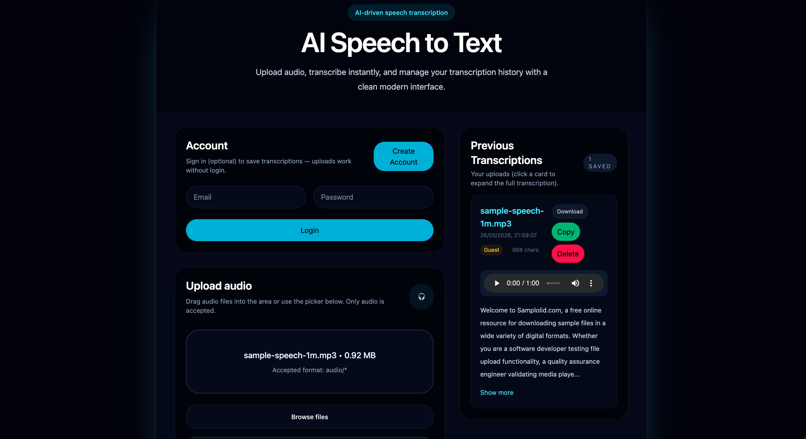
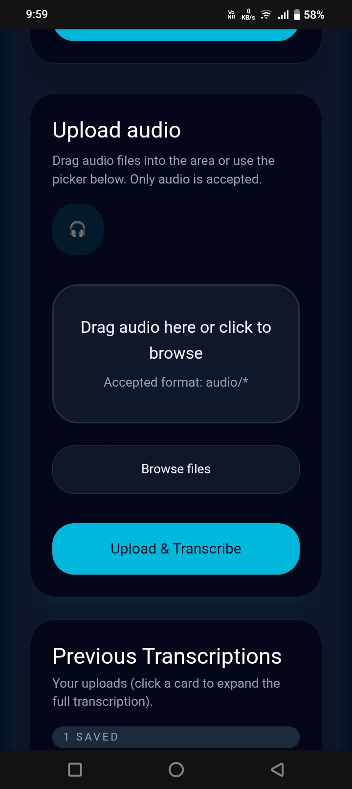

# AI Speech-to-Text App

A polished full-stack speech transcription app with a modern glassmorphism UI, optional Supabase authentication, drag-and-drop audio upload, transcription history, and audio playback.

## Live Demo

Frontend: https://speech-to-text-app-three-puce.vercel.app

## Overview

This project is a complete AI-powered speech-to-text application built with React on the frontend and Express/MongoDB on the backend. Users can upload audio files, convert them into text using the Groq API, and manage their transcription history. Authentication is optional, allowing guest uploads while still supporting account-based history and saved transcriptions.

## Features

- Audio upload and transcription
- Drag-and-drop file upload UI
- Optional Supabase authentication (guest mode supported)
- Transcription history for logged-in users
- Audio playback for saved uploads
- Copy, delete, and manage transcript records
- Responsive mobile-first design with Tailwind CSS
- MongoDB Atlas persistence
- Groq API speech transcription integration

## Screenshots

### Desktop View



### Mobile View



## Tech Stack

- Frontend: React, Tailwind CSS, Vite
- Backend: Node.js, Express.js
- Database: MongoDB Atlas
- AI transcription: Groq API
- Authentication: Supabase
- Hosting: Vercel (frontend), Render (backend)

## Installation

1. Clone the repository:
   ```bash
   git clone <your-repo-url>
   cd speech-to-text-app
   ```

2. Install server dependencies:
   ```bash
   cd server
   npm install
   ```

3. Install client dependencies:
   ```bash
   cd ../client
   npm install
   ```

## Environment Variables

Create a `.env` file inside `server/` and `client/` as needed.

### Server `.env`

```env
MONGO_URI=<your-mongodb-atlas-connection-string>
GROQ_API_KEY=<your-groq-api-key>
PORT=3000
```

### Client `.env`

```env
VITE_SUPABASE_URL=<your-supabase-url>
VITE_SUPABASE_ANON_KEY=<your-supabase-anon-key>
VITE_API_BASE=http://localhost:3000
```

## Frontend Deployment

1. Build the client:
   ```bash
   cd client
   npm run build
   ```

2. Deploy the `client` project to Vercel, or use any static host that supports Vite output.

3. Ensure environment variables are configured in your Vercel project.

## Backend Deployment

1. Deploy the `server` folder to Render, Heroku, or any Node.js host.
2. Configure the required environment variables in the hosting dashboard.
3. Make sure `server` is publicly accessible and that the frontend uses the server URL as `VITE_API_BASE`.

## API Workflow

1. Frontend sends `POST /transcribe` with a multipart form containing the audio file and `userId`.
2. Backend saves the file, calls the Groq audio transcription API, and stores the transcript in MongoDB.
3. Frontend polls `GET /transcriptions?userId=<userId>` for saved history.
4. Frontend can delete entries using `DELETE /transcriptions/:id`.

## Folder Structure

```text
speech-to-text-app/
├── client/
│   ├── public/
│   ├── src/
│   │   ├── components/
│   │   ├── App.jsx
│   │   ├── index.css
│   │   └── main.jsx
│   ├── package.json
│   └── vite.config.js
├── server/
│   ├── models/
│   │   └── Transcription.js
│   ├── uploads/
│   ├── index.js
│   ├── package.json
│   └── .env
└── README.md
```

## Challenges Solved

- Fixed MongoDB Atlas connection and deployment issues
- Configured cross-platform frontend/backend deployment
- Implemented responsive mobile-first UI
- Debugged production API and environment variable errors
- Managed cloud deployment using Vercel and Render

## Future Improvements

- Add user profile settings and upload quotas
- Add progress indicators for large audio uploads
- Support transcription editing and version history
- Add search/filter by transcript text or date
- Add WebSocket updates for live transcription status
- Add better role-based security and Supabase JWT validation

> Note: Backend is hosted on Render free tier, so the first request after inactivity may take a few seconds.

## Author

Created by **Sowjith**.

Feel free to customize the README with your repository URL, contact info, or demo link.